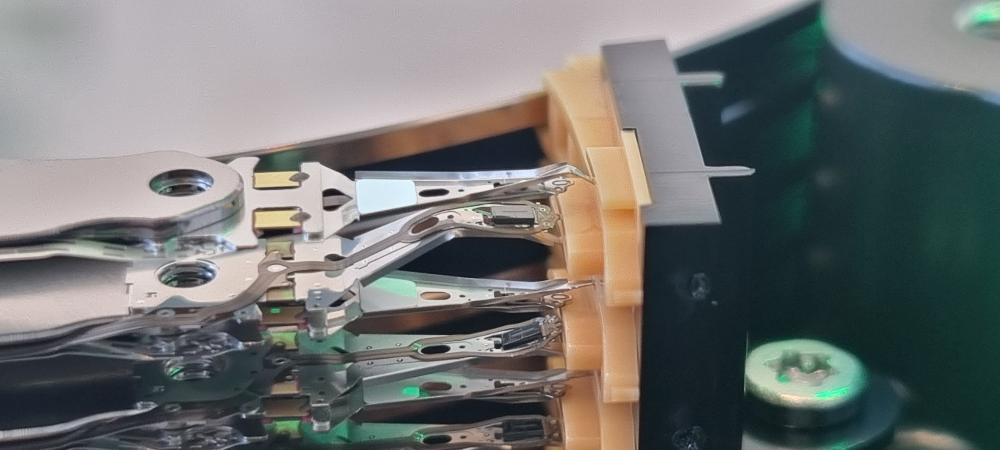

# 🧾 Case #001 - Severe Head Stack Damage

**Drive Model:** Seagate Exos 7E8 10TB
**Serial Number:** (redacted)
**Capacity:** 10TB
**Interface:** SATA
**Date Diagnosed:** June 2025

---

## 🛠️ Symptoms

* Drive failed to spin up properly.
* Clicking noise was audible upon power-up.
* Not detected by BIOS or disk utility tools.

---

## 🔬 Diagnostic Steps

1. **Visual inspection** in a clean environment revealed significant physical damage to the head stack assembly.
2. **Actuator arms** appear bent and displaced.
3. Several heads made contact with platters, indicating a likely head crash.

---

## 📸 Evidence

*Close-up photo of the internal actuator assembly showing bent and misaligned read/write heads.*

---

## 🧪 Analysis

This drive experienced catastrophic mechanical failure, most likely from a shock event while powered off. The alignment of the head arms was compromised, and scraping marks were observed on the platter surfaces.

Due to the extent of damage and platter contact, the likelihood of successful recovery using head replacement is extremely low.

---

## ✅ Outcome

**Status:** Unrecoverable
**Reason:** Severe physical damage and potential platter surface scoring.

---

## 🧠 Notes

* This case reinforced the importance of mechanical handling precautions for enterprise-grade drives.
* Serves as a key visual reference for identifying head crash aftermath.

---

[⬅ Back to Case Index](../README.md) • [📁 View Evidence Folder (Case 001)](../evidences/case_001/)
