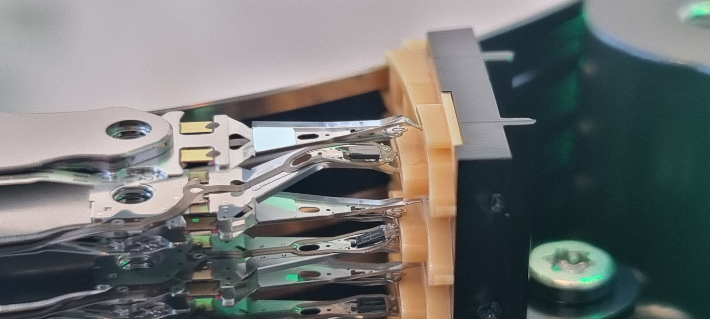

# Case 001 – Catastrophic Head Stack Assembly (HSA) Deformation

---

## 1. Abstract

Enterprise 10TB HDD presented with failure to initialize and repetitive seek recalibration behavior.  
Physical inspection revealed severe geometric deformation of the Head Stack Assembly (HSA), resulting in loss of planar alignment and probable media contact.  

Based on mechanical assessment and risk classification, the device was determined to be non-recoverable under safe operational constraints.

---

## 2. Device Information

- **Model:** Seagate Exos 7E8  
- **Capacity:** 10TB  
- **Interface:** SATA  
- **Drive Class:** Enterprise HDD  
- **Serial:** (redacted)  
- **Case Date:** June 2025  

---

## 3. Reported Symptoms

- Drive fails to reach stable ready state.
- Repetitive clicking upon power-up (indicative of seek recalibration attempts).
- Device not detected by BIOS or OS-level utilities.
- No stable identify response observed.

> Audible clicking was treated as a symptom, not a standalone diagnosis.

---

## 4. Physical Inspection Findings

### 4.1 Head Stack Assembly (HSA) Condition

Inspection revealed:

- Severe geometric deformation of actuator arms.
- Non-parallel alignment between head gimbal assemblies (HGAs).
- Vertical displacement across multiple head elements.
- Loss of planar consistency relative to platter surface.
- Evidence of mechanical torsion within actuator structure.

The deformation exceeds acceptable alignment tolerances required for micron-level head flying height stability.

---

### 4.2 Media Risk Assessment

Although platter surface images were not captured, the observed HSA deformation strongly suggests:

- Likely head-to-media contact.
- Potential radial scoring across head travel path.
- Possible contamination from debris generation.

Any additional spin-up cycles would significantly increase risk of further media destruction.

---

## 5. Failure Analysis

### 5.1 Probable Failure Mode

Failure characteristics are consistent with catastrophic mechanical shock or abnormal actuator loading event resulting in:

- Loss of head alignment geometry.
- Servo tracking instability.
- Inability to achieve controlled seek calibration.

### 5.2 Mechanical Tolerance Consideration

Enterprise HDD heads operate within extremely tight vertical and angular tolerances.  
Observed deformation prevents:

- Reliable servo lock acquisition.
- Stable track following.
- Safe read attempts without compounding damage.

---

## 6. Engineering Decision & Recoverability Assessment

**Decision:** NO-GO (No recovery attempt performed)

### Technical Justification:

- Structural HSA deformation beyond safe operational tolerance.
- High probability of media surface compromise.
- Extremely high risk of further data loss if powered.

---

## 7. Failure Classification

- **Category:** Catastrophic Mechanical Failure  
- **Subsystem:** Head Stack Assembly (HSA)  
- **Severity Level:** Critical  
- **Recoverability Index:** < 10%  

---

## 8. Lessons & Engineering Notes

- Mechanical integrity thresholds must be evaluated before any recovery attempt.
- Establishing a clear No-Go classification prevents unnecessary media destruction.
- Catastrophic HSA deformation is visually identifiable through geometric misalignment patterns.

---

[⬅ Back to Case Index](../README.md)
