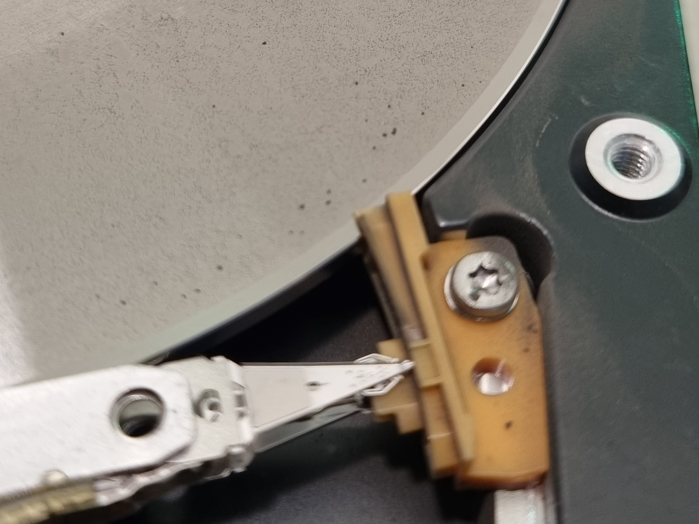
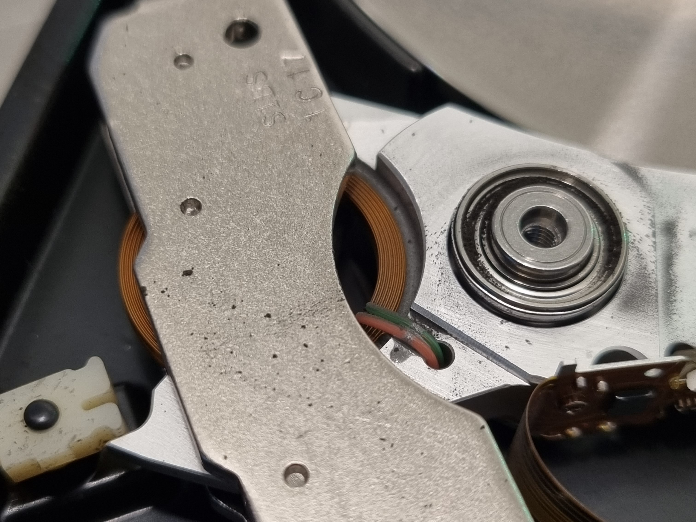
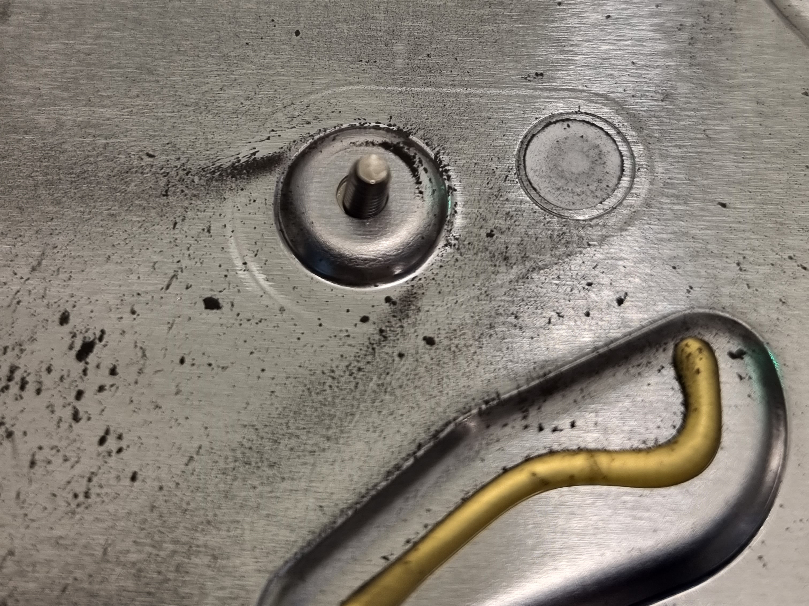
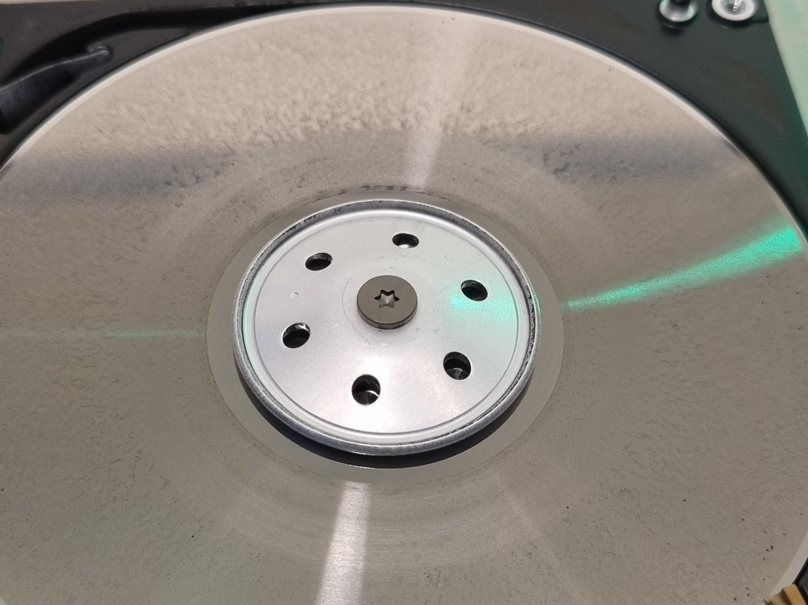

# 🧾 Case #003 – Severe Platter Contamination

**Drive Model:** (Unknown – label unreadable / not provided)  
**Capacity:** —  
**Interface:** SATA  
**Date Diagnosed:** 12/22/2022 

---

## 🛠️ Symptoms

- Drive spins up but does not reach readiness.  
- Not detected by BIOS or recovery tools.  
- No clicking spindle reaches speed but the heads cannot initialize servo.  
- Suspected mechanical failure based on sound and lack of ID.  

---

## 🔬 Diagnostic Steps

1. Drive was opened for inspection (clean environment).  
2. Severe platter surface contamination was immediately observed.  
3. Head Stack Assembly (HSA) found fully contaminated with metallic debris.  
4. Load/Unload ramp coated with particulate residue.  
5. Actuator pivot and internal base surfaces found with heavy magnetic dust.  
6. Determined that the magnetic layer of the platters had been scraped off due to catastrophic head-to-platter contact.  

---

## 🎥 Evidence

**Severe Platter Contamination due to Catastrophic Head Crash**

---

## 🧪 Analysis

The drive suffered a **catastrophic head crash**, resulting in **complete destruction of the magnetic layer** across multiple platter surfaces.  
This produced heavy metallic debris, which spread throughout the drive’s interior, contaminating:

- The Head Stack Assembly (HSA)  
- Platter surfaces  
- Actuator pivot bearing  
- Load/Unload ramp  
- Base casting and internal components  

Because the platter coating was physically removed, **servo tracks were destroyed**, making it impossible for any replacement heads to lock onto servo and read LBA sectors.

Additionally, new heads would immediately be destroyed due to the overwhelming level of particulate contamination.

This type of failure is classified as **mechanically catastrophic and physically unrecoverable**.

---

## ✅ Outcome

**Status:** ❌ Not Recoverable  
**Reason:** Severe platter surface destruction and contamination made data extraction impossible.  
No firmware, head swap, or cleanroom operation can recover data when the magnetic media itself is gone.

---

## 🧠 Notes

- Failure likely caused by shock/impact while the drive was spinning or by progressive head degradation.  
- Contamination levels indicate prolonged scraping before motor spin-down.  
- This case demonstrates how debris propagation inside the drive can lead to total media loss.  

[⬅ Back to Case Index](../README.md)

