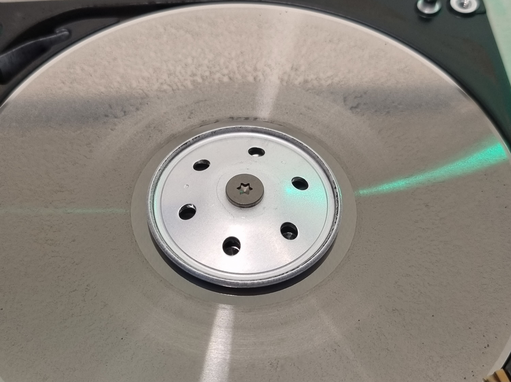
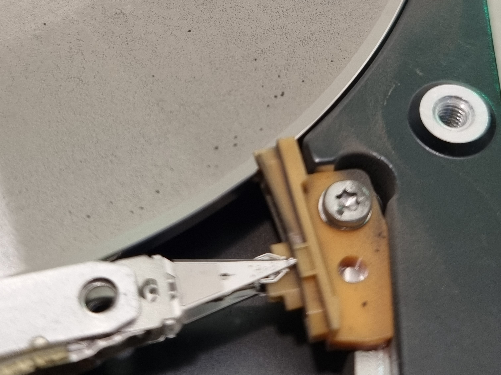
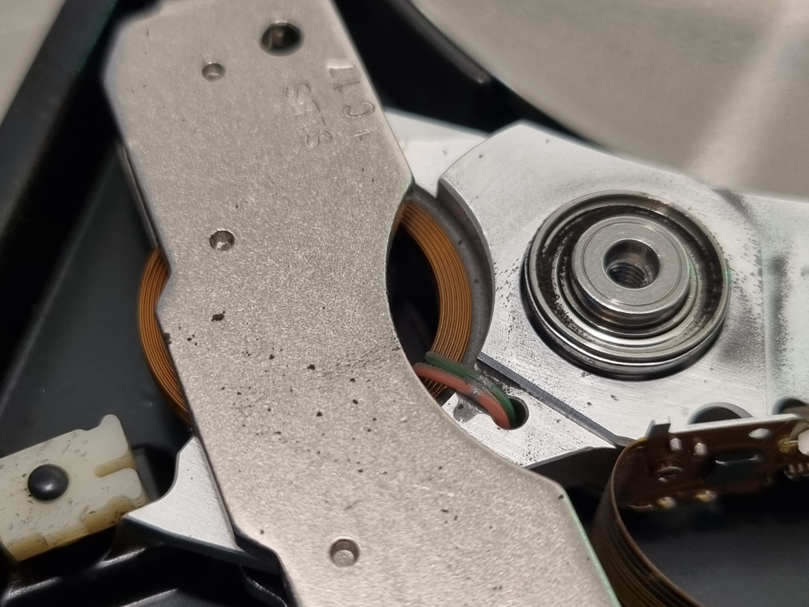
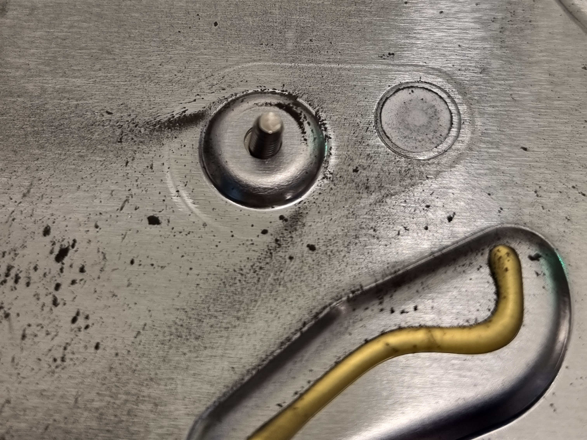
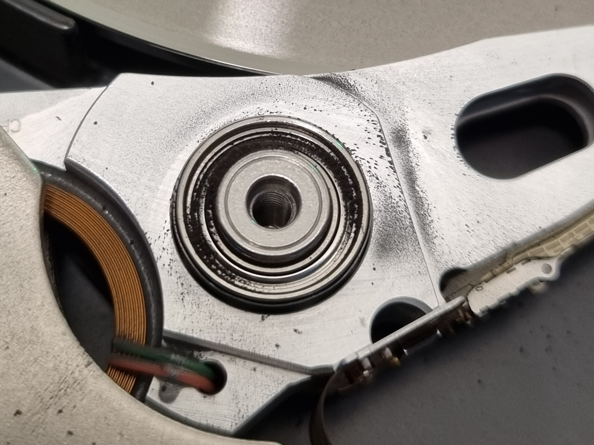

# Case 003 – Catastrophic Media Surface Destruction & Internal Contamination

---

## 1. Abstract

SATA HDD presented with spin-up behavior but failed to complete servo initialization and was not detected at host level.  

Internal inspection revealed severe platter surface damage accompanied by widespread particulate contamination throughout the internal assembly.  

Failure classified as catastrophic media destruction with zero recoverability due to loss of magnetic recording layer integrity and servo track destruction.

---

## 2. Device Information

- **Model:** Unknown (label unreadable / not provided)
- **Interface:** SATA
- **Case Date:** 12/22/2022
- **Drive Class:** Magnetic HDD

---

## 3. Reported Symptoms

- Drive spins to operational RPM.
- No stable readiness state achieved.
- No BIOS detection.
- No repetitive recalibration clicking observed.
- Heads unable to achieve servo lock.

---

## 4. Internal Inspection Findings

### 4.1 Platter Surface Condition

Inspection revealed:

- Severe radial scoring across platter surfaces.
- Visible removal of magnetic coating layer.
- Exposed substrate in multiple regions.
- Surface abrasions extending across head travel path.

---

### 4.2 Contamination Assessment

Heavy metallic particulate contamination observed throughout internal cavity:

- Head Stack Assembly (HSA) coated in debris.
- Load/Unload ramp contaminated.
- Actuator pivot bearing exposed to magnetic dust.
- Base casting and internal chassis surfaces covered in residue.
- VCM magnet area accumulated fine ferromagnetic particles.

---

## 5. Failure Analysis

### 5.1 Failure Mode

Failure characteristics consistent with catastrophic head-to-media contact event resulting in:

- Abrasive destruction of magnetic recording layer.
- Debris propagation across internal mechanical components.
- Servo track destruction across affected zones.

### 5.2 Mechanical & Magnetic Implications

When magnetic coating is physically removed:

- Servo bursts become unreadable.
- Track positioning becomes impossible.
- Adaptive recalibration cannot compensate.
- Replacement heads cannot restore servo lock.

Additionally, heavy particulate presence creates:

- Immediate re-destruction risk for any replacement HSA.
- High probability of further media abrasion upon spin-up.

---

## 6. Engineering Decision & Recoverability Assessment

**Decision:** NO-GO (No recovery attempt performed)

### Technical Justification:

- Magnetic recording layer physically destroyed.
- Servo infrastructure compromised.
- Contamination level incompatible with safe head replacement.
- Zero probability of stable track acquisition.

---

## 7. Failure Classification

- **Category:** Catastrophic Mechanical + Media Failure
- **Subsystems Affected:** HSA, Media Surface, Internal Assembly
- **Severity Level:** Critical
- **Recoverability Index:** 0%

---

## 8. Lessons & Technical Notes

- Debris propagation inside HDDs can rapidly escalate failure severity.
- Servo infrastructure destruction eliminates possibility of logical or firmware-level recovery.
- Establishing contamination threshold criteria prevents unnecessary component sacrifice.
- Media-layer removal represents terminal physical failure.

---

[⬅ Back to Case Index](../README.md)
