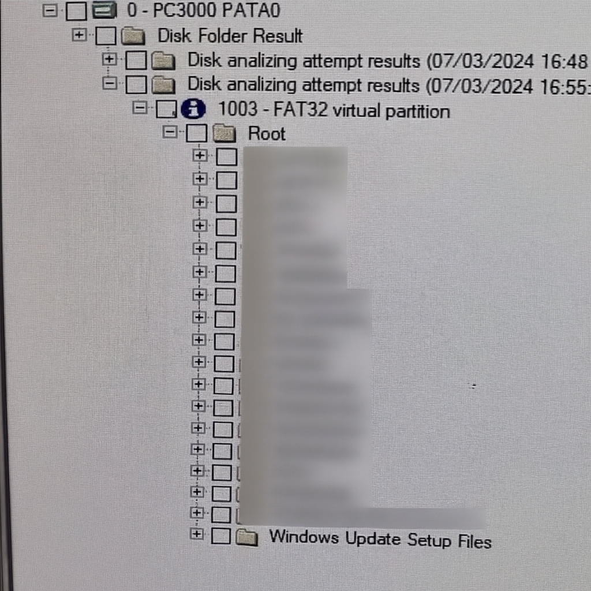
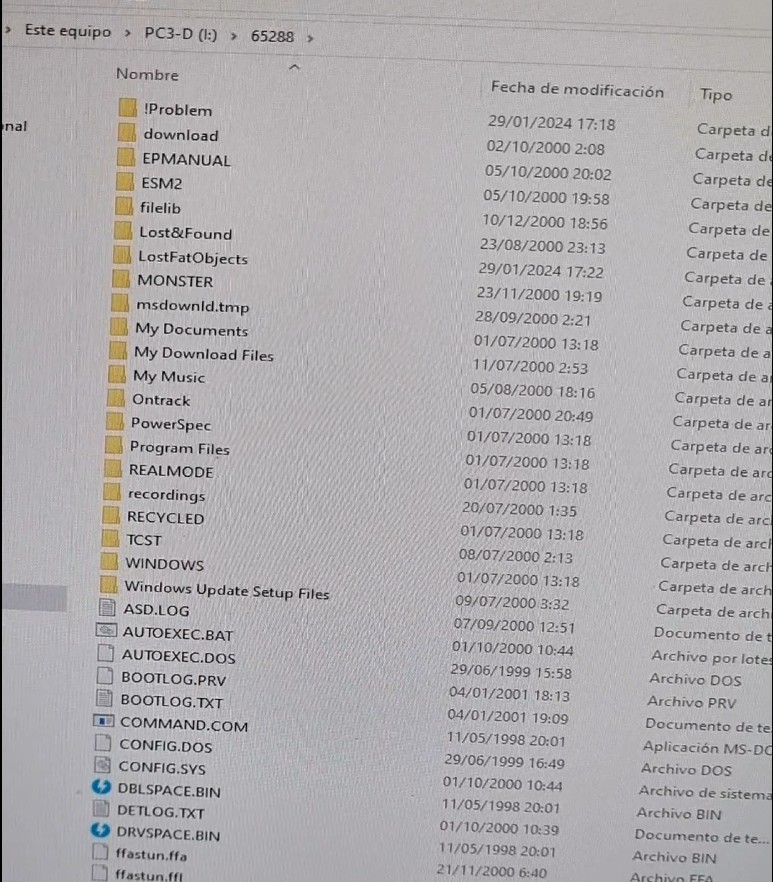

# Case 004 – Legacy IDE HDD: Controlled HSA Contamination Mitigation & Structured Logical Recovery

---

## 1. Abstract

Legacy 4GB Western Digital IDE HDD was received after unsuccessful recovery attempts by a third party.

Initial internal inspection under a controlled ISO 5 environment revealed particulate contamination adhered to the Head Stack Assembly (HSA) slider surfaces, consistent with unstable read behavior.

A conservative mechanical stabilization approach was applied by performing controlled particulate removal on the original head sliders (avoiding donor-part surgery and adaptive mismatch risk). Following stabilization, structured imaging and FAT32 filesystem reconstruction enabled full logical dataset extraction and OS-level validation.

---

## 2. Device Information

- **Manufacturer:** Western Digital  
- **Capacity:** 4GB  
- **Interface:** IDE (PATA)  
- **Drive Class:** Legacy Magnetic HDD  
- **Previous Attempt:** Third-party unsuccessful recovery  
- **Environment:** Air Science Class 100 / ISO 5 Laminar Flow Bench  

---

## 3. Mechanical Findings & Stabilization

### 3.1 Internal Inspection Findings

Upon opening the HDA (Hard Drive Assembly) under controlled conditions, the following was observed:

- **Media particulates:** Micro-debris consistent with magnetic media particulate contamination was adhered to the head slider surfaces.
- **Surface integrity:** No catastrophic “ring of death” patterns or deep scoring were observed, supporting a conservative mitigation approach.

> Note: Absence of visible deep scoring does not guarantee zero media damage; it indicates no immediately obvious catastrophic surface destruction.

### 3.2 Engineering Decision (Conservative Mitigation)

Instead of pursuing head replacement, a conservative stabilization strategy was selected due to:

- Higher risk of adaptive mismatch on early-generation firmware families when introducing donor components.
- Increased probability of compounding damage if unstable heads are repeatedly powered during failed read attempts.

**Mitigation performed:** Controlled particulate removal from the original head slider surfaces to restore stable flying-height conditions sufficient for controlled read operations.

> Detailed procedural steps intentionally omitted.

---

## 4. Post-Mitigation Functional Verification

Following mechanical stabilization:

- Drive successfully reached a stable initialized state.
- Model, serial, and capacity were correctly detected.
- Utility successfully loaded in the PC-3000 environment.
- A stable Identify response was achieved.

---

## 5. Logical Analysis

### 5.1 Filesystem Access Attempt

Initial attempt to enumerate filesystem structures failed due to:

- A corrupted / unstable LBA affecting the root directory structure region.
- Partition present but directory traversal unsuccessful.
- Critical sector instability blocking structure generation and directory enumeration.

---

## 6. Controlled Imaging Strategy

Given localized sector instability, controlled imaging was selected over direct extraction:

- Selective sector imaging configured.
- Filesystem-critical LBAs prioritized to enable faster structural recovery.
- Read parameters tuned to minimize stress and avoid repeated high-risk read cycles.
- Acquisition initiated under controlled error-handling constraints.

---

## 7. Acquisition Process

- Sector-by-sector acquisition performed.
- Transfer behavior monitored (speed, stability, error regions).
- Error handling applied to isolate unstable regions and prevent amplification of damage.
- Output image prepared for offline reconstruction.

---

## 8. Filesystem Reconstruction

Post-acquisition analysis:

- Disk analysis procedure executed.
- Filesystem structures reconstructed (FAT32).
- Directory tree successfully rebuilt.
- Logical traversal and file enumeration restored.

---

## 9. Data Extraction & Validation

- Extracted dataset validated against reconstructed directory tree.
- Files confirmed readable in OS environment.
- Cross-validation performed between PC-3000 view and Windows directory output.

---

## 10. Engineering Assessment

### Failure Mode

- HSA slider contamination producing unstable read conditions, combined with localized LBA corruption affecting root directory structures and preventing partition traversal.

### Recovery Factors

- No immediately visible catastrophic media surface destruction.
- Mechanical geometry remained intact post-stabilization.
- Logical corruption localized to filesystem-critical structures (root directory region).

### Risk Considerations

- Any internal inspection introduces contamination risk; controlled environment and conservative actions were required.
- Unstable LBAs necessitated controlled imaging rather than repeated direct filesystem access attempts.

---

## 11. Outcome

- **Status:** Fully Recovered  
- **Recovery Class:** Mechanical Stabilization + Logical Reconstruction  
- **Data Integrity:** Preserved (post-extraction validation)  
- **Recoverability Index:** High (post-stabilization)  

---

## 12. Lessons & Technical Notes

- Not all “non-detect / non-traversable” cases are catastrophic; contamination severity and media integrity must be classified before declaring non-recoverable.
- Conservative mitigation can be preferable to donor surgery when original HSA electrical integrity is intact and media surface damage is not immediately catastrophic.
- Filesystem-level corruption can coexist with recoverable mechanical conditions.
- Controlled imaging reduces read stress and enables safer offline reconstruction when critical LBAs are unstable.

---

[⬅ Back to Case Index](../README.md)
