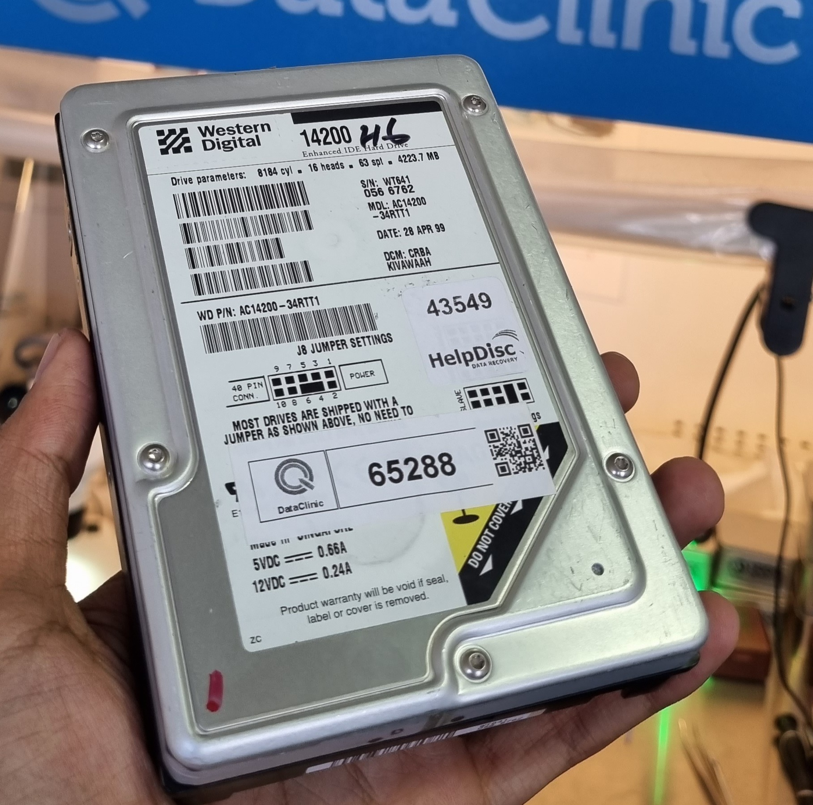
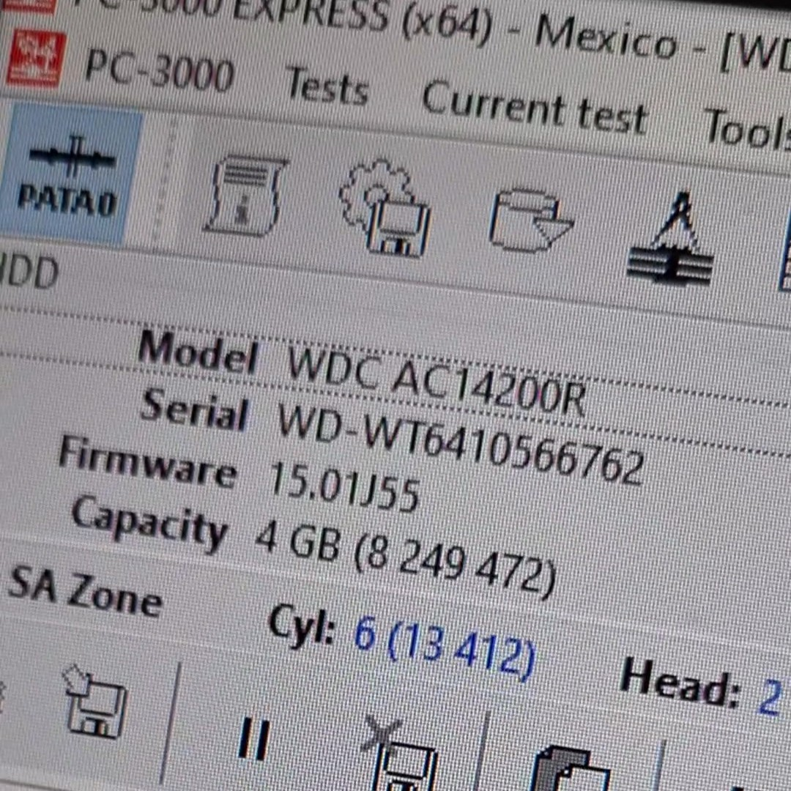

# Case 004 – Legacy IDE HDD: Controlled HSA Contamination Mitigation & Structured Logical Recovery

---

## 1. Abstract

Legacy 4GB Western Digital IDE HDD presented after unsuccessful recovery attempts by a third party.  

Initial inspection revealed minor head contamination preventing stable read initialization.  
After controlled internal inspection and contamination mitigation, the device successfully reached operational state.  

Subsequent structured cloning and filesystem reconstruction enabled full data extraction.

---

## 2. Device Information

- **Manufacturer:** Western Digital  
- **Capacity:** 4GB  
- **Interface:** IDE (PATA)  
- **Drive Class:** Legacy Magnetic HDD  
- **Previous Attempt:** Third-party unsuccessful recovery

---

## 3. Reported Symptoms

- Drive powers on.
- No abnormal mechanical noise.
- Unable to access filesystem structures.
- Partition visible but not traversable.
- LBA-level read instability affecting directory structures.

---

## 4. Mechanical Assessment

### 4.1 Initial Internal Inspection

Internal inspection revealed:

- Light contamination present on head elements.
- No visible severe platter scoring.
- No actuator deformation observed.
- No catastrophic mechanical damage.

Contamination likely responsible for unstable read behavior during initialization.

> Controlled contamination mitigation performed.  
> Detailed procedural steps intentionally omitted.

---

## 5. Post-Mitigation Functional Verification

Following mechanical stabilization:

- Drive successfully initialized.
- Model, serial and capacity correctly detected.
- Utility successfully loaded via PC-3000 environment.
- Stable identify response achieved.

---

## 6. Logical Analysis

### 6.1 Filesystem Access Attempt

Initial attempt to explore filesystem structures failed due to:

- Corrupted LBA affecting root directory region.
- Partition present but traversal unsuccessful.
- Critical sector instability blocking directory enumeration.

---

## 7. Controlled Cloning Strategy

Given localized sector damage:

- Selective sector cloning configured.
- Critical filesystem LBAs prioritized.
- Read parameters adjusted to minimize stress.
- Controlled acquisition initiated.

(Video evidence: sector selection and cloning parameters.)

---

## 8. Acquisition Process

- Stable sector-by-sector copy performed.
- Transfer rate monitored.
- Error handling strategy applied.
- Damaged regions isolated.

(Video evidence: cloning progress visualization.)

---

## 9. Filesystem Reconstruction

Post-acquisition analysis:

- Disk Analysis procedure executed.
- Filesystem structures rebuilt.
- Directory tree successfully reconstructed.
- Logical traversal restored.

(Video evidence: successful structure enumeration.)

---

## 10. Data Extraction & Validation

- Extracted data verified against reconstructed directory tree.
- Files confirmed readable in OS environment.
- Cross-validation between PC-3000 and Windows directory view performed.

(Video evidence: final extracted data.)

---

## 11. Engineering Assessment

### Failure Mode
Minor HSA contamination causing unstable read conditions combined with localized LBA corruption affecting directory structures.

### Recovery Factors
- No media surface destruction.
- Mechanical integrity preserved.
- Corruption limited to critical logical region.

### Risk Considerations
- Additional contamination risk during internal inspection.
- LBA instability required controlled cloning approach.

---

## 12. Outcome

**Status:** Fully Recovered  
**Recovery Class:** Mechanical Stabilization + Logical Reconstruction  
**Data Integrity:** Preserved  
**Recoverability Index:** High (post-stabilization)

---

## 13. Lessons & Technical Notes

- Not all internal inspections indicate catastrophic failure; contamination severity must be classified before declaring non-recoverable.
- Legacy drives often allow recovery if mechanical geometry remains intact.
- Filesystem-level corruption can coexist with recoverable mechanical conditions.
- Structured cloning prevents additional stress on unstable LBAs.

---

[⬅ Back to Case Index](../README.md)
